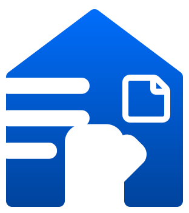

# Personal Task App 📝

Aplikasi Manajemen Tugas yang sederhana namun indah dengan gaya **glassmorphism**, dibangun menggunakan **Laravel 10**, **Tailwind CSS**, dan **Alpine.js**.



## ✨ Fitur Utama

### 🎨 Antarmuka & Pengalaman Pengguna (UI/UX)
-   **Desain Glassmorphism**: Komponen UI modern yang transparan dengan efek blur.
-   **Dark Mode Ready**: Tampilan responsif sepenuhnya yang terlihat bagus baik dalam tema terang maupun gelap.
-   **Layout Responsif**: Dioptimalkan untuk perangkat Desktop, Tablet, dan Ponsel.
-   **Scrollbar Kustom**: Scrollbar bertema gelap yang ramping untuk tampilan yang lebih rapi.

### 🚀 Fungsi Utama
-   **Dashboard**:
    -   Statistik real-time (Tugas Tertunda, Selesai, Total Tugas).
    -   **Kutipan Motivasi**: Kutipan acak (Bahasa Indonesia) untuk menjaga semangat Anda.
    -   **Sapaan Spesial**: Pesan sambutan yang dipersonalisasi.
    -   **Grafik Visual**: Diagram donat untuk distribusi kategori dan analisis prioritas.
-   **Manajemen Tugas**:
    -   Buat, Baca, Ubah, Hapus (CRUD) tugas.
    -   Kategorikan tugas (Kerjaan, Pribadi, dll) dengan warna kustom.
    -   Atur Prioritas (Rendah, Menengah, Tinggi, Mendesak).
    -   **Indikator Deadline**: Penanda visual untuk tugas yang terlambat (Merah) dan tugas yang akan segera jatuh tempo (Kuning).
-   **Manajemen Kategori**: Kelola kategori kustom untuk mengatur alur kerja Anda.
-   **Pengingat Email**: Notifikasi email otomatis untuk tugas yang jatuh tempo dalam 2 atau 3 hari.

### ⚙️ Pengaturan & Personalisasi
-   **Dukungan Multi-Bahasa**: Beralih antara **Bahasa Inggris** dan **Bahasa Indonesia** dengan mudah.
-   **Manajemen Profil**: Perbarui nama, email, dan unggah **Foto Profil**.
-   **Otentikasi**:
    -   Login & Registrasi yang aman.
    -   Alur **Lupa Password** dengan opsi "Kembali ke Login".
    -   Dukungan login menggunakan Username.

## 🛠️ Teknologi yang Digunakan

-   **Framework**: [Laravel 10](https://laravel.com/) (PHP)
-   **Frontend**: [Blade Templates](https://laravel.com/docs/blade)
-   **Styling**: [Tailwind CSS](https://tailwindcss.com/)
-   **Interaktivitas**: [Alpine.js](https://alpinejs.dev/)
-   **Database**: MySQL

## 🚀 Instalasi & Pengaturan

Ikuti langkah-langkah ini untuk menjalankan proyek secara lokal:

1.  **Clone Repository**
    ```bash
    git clone https://github.com/Bhadthepramdirdjo/PersonalTaskAPP.git
    cd PersonalTaskAPP
    ```

2.  **Install Dependensi PHP**
    ```bash
    composer install
    ```

3.  **Install Dependensi Frontend**
    ```bash
    npm install
    ```

4.  **Konfigurasi Environment**
    -   Salin file contoh environment:
        ```bash
        cp .env.example .env
        ```
    -   Perbarui pengaturan database di `.env` (DB_DATABASE, DB_USERNAME, dll).
    -   Perbarui pengaturan email jika Anda ingin menguji pengingat email (MAIL_MAILER, MAIL_HOST, dll).

5.  **Generate Application Key**
    ```bash
    php artisan key:generate
    ```

6.  **Jalankan Migrasi & Seeder**
    Ini akan menyiapkan tabel database dan data default (prioritas, pengaturan pengguna).
    ```bash
    php artisan migrate --seed
    ```

7.  **Build Aset**
    ```bash
    npm run build
    ```

8.  **Jalankan Aplikasi**
    ```bash
    php artisan serve
    ```
    Akses aplikasi di `http://localhost:8000`.

## 📖 Panduan Penggunaan

1.  **Registrasi**:
    -   Buat akun baru di halaman `/register`.
2.  **Dashboard**:
    -   Setelah login, Anda akan melihat dashboard dengan ringkasan tugas dan kutipan motivasi.
3.  **Mengelola Tugas**:
    -   Pergi ke **My Tasks** untuk melihat daftar tugas.
    -   Klik **New Task** untuk menambahkan item to-do. Pilih kategori, prioritas, dan tenggat waktu.
    -   Tandai tugas sebagai selesai dengan mengklik kotak centang atau ikon status.
    -   Tugas yang sudah selesai lebih dari 7 hari akan dibersihkan secara otomatis.
4.  **Kategori**:
    -   Pergi ke **Categories** untuk membuat atau menghapus kategori tugas (misalnya: "Kantor", "Hobi").
5.  **Pengaturan**:
    -   Klik dropdown **Profil** atau **Settings** di sidebar.
    -   Ubah **Bahasa** (Inggris/Indonesia) di bawah "Application Preferences".

## ❓ Alasan Pembuatan

> "Awalnya dibuat untuk mempermudah menyusun tugas-tugas yang banyak, agar lebih tercatat rapi. Fitur pengingat ditambahkan untuk membantu mengingatkan agar tidak lupa deadline penting."

## 🤝 Kontribusi

Proyek ini adalah **Proyek Pribadi** dan saat ini **TIDAK** menerima kontribusi dari luar (tidak menerima Pull Request).
Namun, Anda bebas untuk melakukan *fork* repository ini untuk pembelajaran atau penggunaan pribadi sesuai dengan lisensi yang berlaku.

## 📄 Lisensi

Proyek ini adalah open-source dan tersedia di bawah [lisensi MIT](https://opensource.org/licenses/MIT).

---
*Dibuat oleh Bhadriko Theo Pramudya Djojosoedirdjo - 2026*
